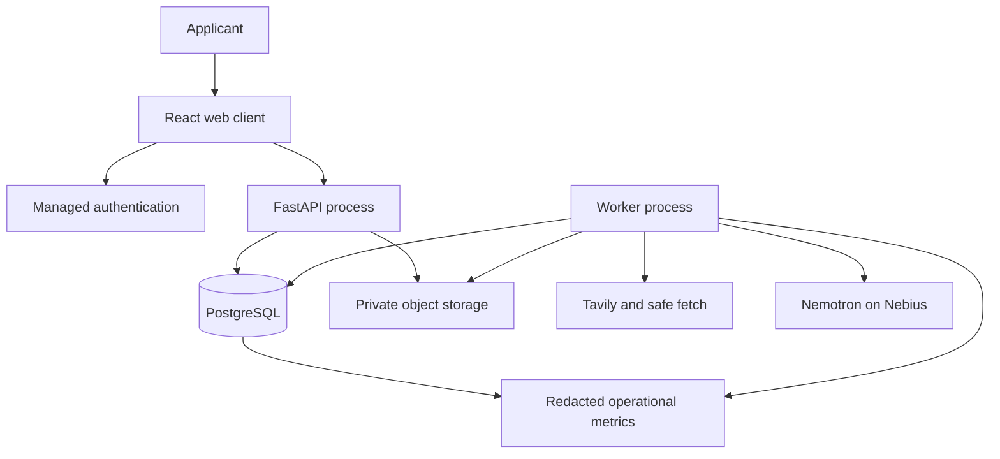
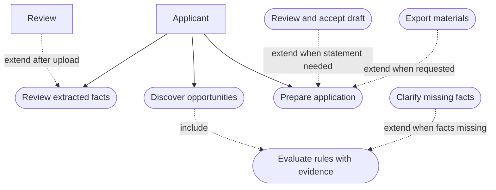
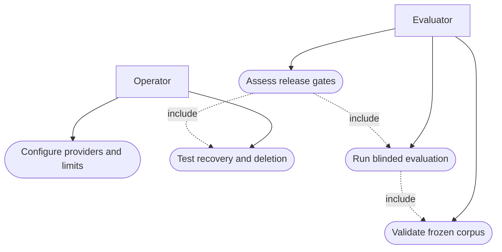
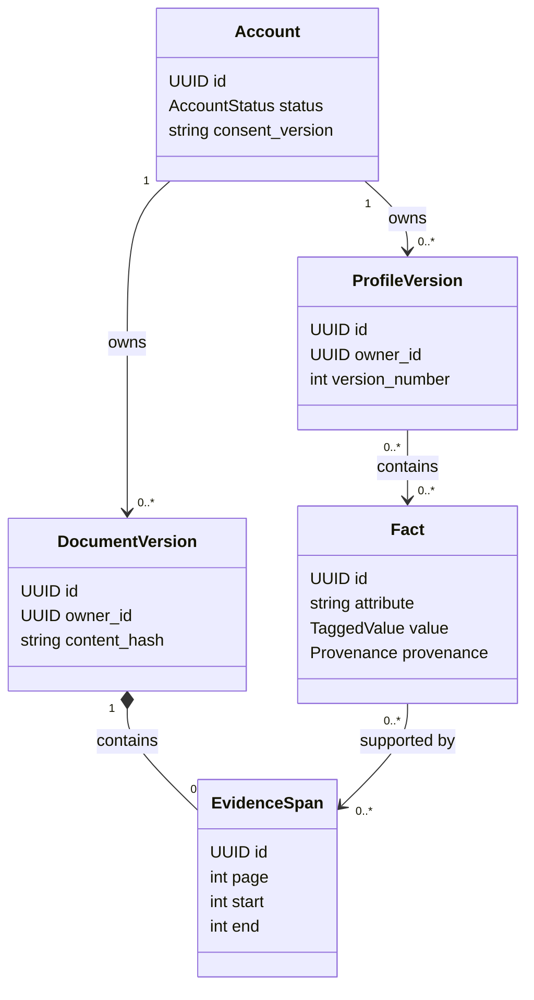
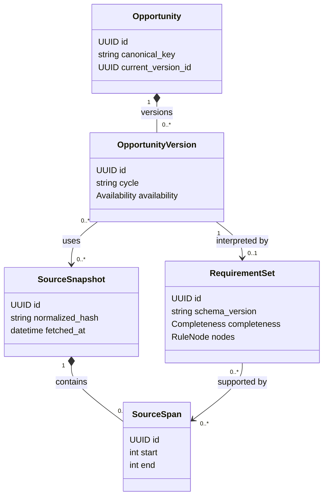
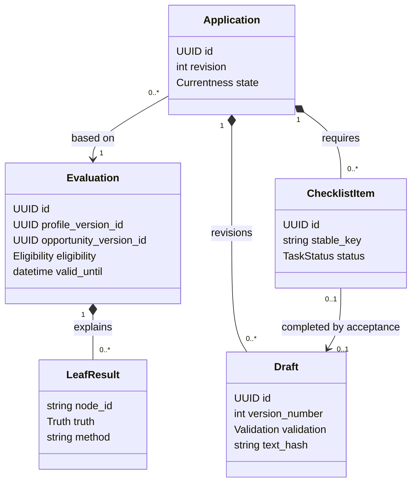
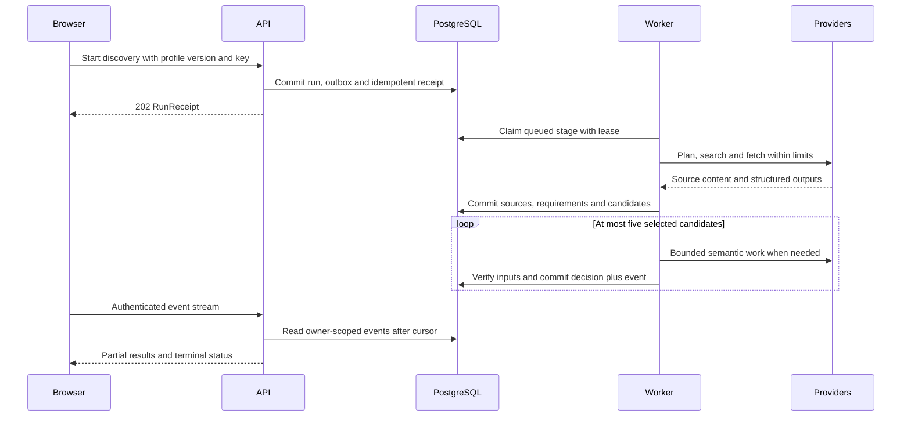
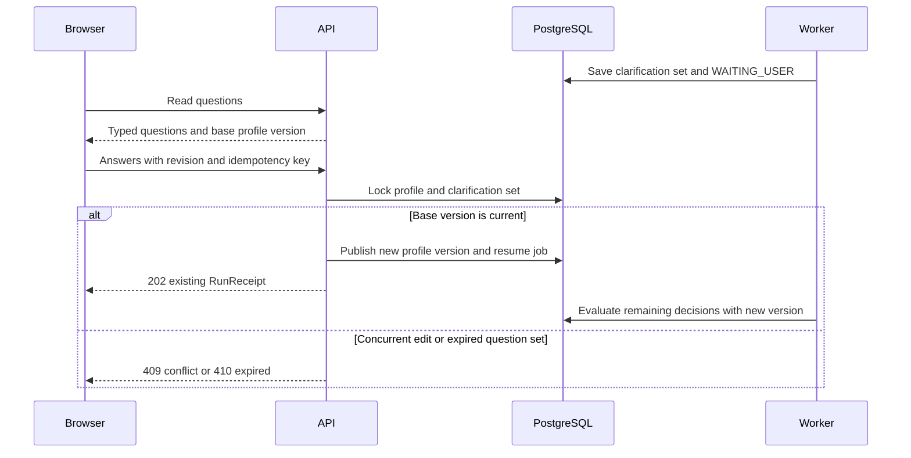
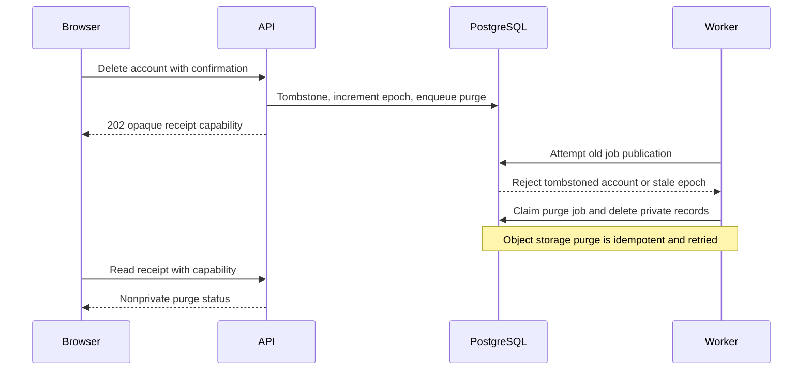
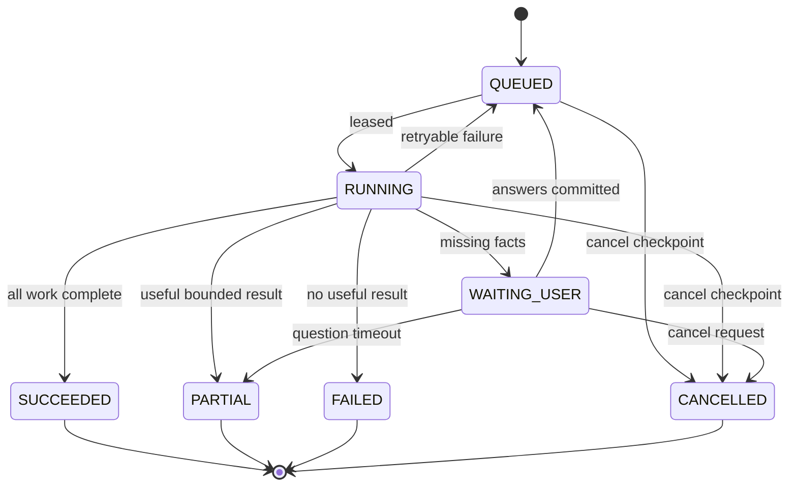

# BenefitBridge — System Architecture and Evaluation Design

**BenefitBridge · Best Apps and Agents · Six-person implementation package · 4 October 2026**

[requirements.md](requirements.md) | [userStory.md](userStory.md) | [sprints.md](sprints.md) | [design.md](design.md) | [API.md](API.md) | [plan.md](plan.md) | [agent.md](agent.md)

BenefitBridge helps undergraduate and early-career applicants discover internships/research placements and scholarships/funded student programs, compare published requirements with their confirmed facts and evidence, and prepare an application. The product reports what the supplied policy and evidence justify; the provider makes the actual selection decision.

P0 uses English official HTML pages and readable PDFs, applicants based in Egypt with potentially international opportunities, one applicant per account, structured facts, optional documents, bounded live discovery, explicit refresh, evidence-backed tri-state decisions and reviewed Markdown export. P1 contains only the saved-page watch slice in this package. OCR, Arabic documents, unrestricted grants/public benefits, advisor tenants, autonomous submission, email/calendar integrations, embeddings, training and microservices remain deferred.

This is a design and execution package. No application, deployment, benchmark result or user-study result is claimed as completed. Acceptance numbers are proposed gates, not measurements. A single prompt defines one bounded implementation assignment; code review and the specified checks remain mandatory.

## 1. Architecture decisions and implementation baseline

Build a **modular monolith** with a React web client, FastAPI API process and separate worker processes from the same Python package. PostgreSQL is the authoritative store and durable queue. Public policy processing is reusable across users; all applicant facts, documents, runs, decisions and drafts are private. There is no separate microservice per logical agent and no arbitrary model-controlled tool loop.

| Layer | Selected baseline | Implementation boundary |
| --- | --- | --- |
| Browser | TypeScript strict mode, React 19, Vite, React Router, TanStack Query, accessible semantic HTML | Generated API types; no direct application-table queries; memory-only auth session |
| API | Python 3.12, FastAPI, Pydantic v2, Uvicorn | Thin routers → services → repositories; async I/O; standard problem errors |
| Persistence | PostgreSQL 17, SQLAlchemy 2 async, psycopg 3, Alembic | RLS and owner-consistent foreign keys; immutable versions; short transactions |
| Managed services | Supabase Auth and private Storage; managed PostgreSQL deployment compatible with the schema | Auth SDK only for identity; private storage adapter; no app use of unrestricted service role for ordinary SQL |
| Worker | Same Python image, explicit stage registry, Postgres outbox and leased queue | At-least-once execution, logically idempotent outputs and fencing |
| Documents | pypdf in isolated subprocess; bounded extraction; no OCR in P0 | Parse limits and quality detection before fact extraction |
| Sources | Tavily search/extract plus permitted HTTPS adapters; structured HTML extraction | SSRF guard, official-source registry, full-context checks |
| Inference | NVIDIA Nemotron roles through Nebius Token Factory; configurable compatible SDK adapter | FAST, REASON and optional DEEP; structured schemas and measured routing |
| Checks | pytest, Ruff, mypy, Vitest, Playwright, axe checks, Locust or equivalent single chosen load harness | Offline deterministic CI; explicit paid/live suites |
| Hosting | One container image deployed as API and worker processes; static web hosting; managed DB/storage | HTTPS proxy, SSE support, migration job, secrets manager, health checks |

These are selected compatibility baselines, not claims that they are the newest available releases. MS-001 resolves compatible patch versions, records exact lockfiles and container digests, and keeps them stable for the hackathon. Do not add Redis, Celery, LangGraph, Kubernetes or a vector database without a measured need and a reviewed architecture change. PostgreSQL queue capacity is sufficient only after the stated pilot load test passes.

### Deployment topology



The browser talks to application endpoints with bearer auth. The API streams uploads into private storage; it does not parse documents in the request handler. The worker claims committed jobs, calls providers outside DB transactions and persists bounded outputs. Source retrieval never receives a private document URL. Signed downloads are owner-authorized and expire within five minutes; already issued URLs may survive immediate app revocation until object removal or expiry.

### Repository boundaries and bootstrap integration

```text
backend/src/benefitbridge/
  api/                 routers, auth dependencies, registry
  domain/              Pydantic DTOs, tagged values, enums
  db/                  SQLAlchemy tables and repositories
  profiles/ documents/ evidence/ sources/ requirements/
  eligibility/ discovery/ applications/ workflows/
  inference/ usage/ security/ demo/
  config.py ports.py composition.py observability.py
backend/migrations/versions/
frontend/src/{app,components,features,generated,lib,styles}/
tests/{api,contracts,security,integration,fakes}/
evaluation/{schemas,annotation,load}/
scripts/ deploy/ docs/ research/
```

`ports.py` owns typed adapter interfaces; business modules depend on these interfaces rather than SDK globals. MS-002 first exports a components-only OpenAPI 3.1 document directly from Pydantic so early UI scaffolding can use the same generated types. MS-003 extends that exporter with installed FastAPI routes, validates identical component definitions and keeps one generated output pair: `frontend/src/generated/openapi.json` and `frontend/src/generated/api.ts`. Each API module exports `router`, uses named dependency providers from composition and can be mounted in an isolated test app. MS-003 creates an explicit ordered allowlist of the API module names listed by the API ownership table. In development only, allowlisted modules not yet implemented can be absent. Production requires every P0 non-demo router and every referenced handler; `DEMO_ENABLED` additionally requires the demo router/reset handler. Missing functionality is a startup/readiness failure, never a successful placeholder response. Watch prefixes are blocked by a feature gate while disabled.

At each API merge, the owner runs deterministic OpenAPI/client generation against the implemented allowlisted modules. Generated schema/client files may be regenerated as a mechanical exception to the owner's source-file boundary; no hand edits. M3 owns the registry/composition files and reviews DI changes. Existing modules are always mounted explicitly and tested; production composition is completed in MS-075. Earlier integration milestones refer to tested vertical slices in the development composition, not a prematurely complete production deployment. The demo reset plugin is loaded through the predefined demo hook after its implementation; it does not require arbitrary plugin discovery.

## 2. User-visible inputs, outputs and screen behavior

The user first creates an account and accepts a clear processing notice. They can type a profile manually or optionally upload a CV, transcript or enrollment PDF. The service proposes extracted facts, and the user confirms, corrects or rejects them. The user then enters a goal, chooses one of two opportunity lanes and optionally sets country, remote, field and funding preferences. Unknown facts are valid inputs.

Example goal: “Find funded AI research internships for undergraduate students in 2027.” A minimal manually entered profile could contain enrollment=true, degree level=UNDERGRADUATE, field=AI, residence=EG and GPA=3.70/4.00. Citizenship and authorization remain unknown unless the user explicitly supplies them. The goal does not supply those missing facts.

| Screen | Main input/action | Main output | Required state handling |
| --- | --- | --- | --- |
| Welcome/consent | Managed-auth login and processing consent | Private workspace | Expired token, unverified email, declined consent |
| Profile/evidence | Typed facts, optional PDFs, candidate review | Current version, evidence and conflicts | Unknown field, extraction failure, concurrent edit |
| Discover | Goal, lane/preferences or public URL | Progress and candidate feed | Empty, partial, budget limit, provider failure |
| Opportunity detail | Inspect requirement and evidence; answer clarification | Decision matrix and next action | NOT_EVALUATED, UNKNOWN, stale/historical, source conflict |
| Saved | Save/remove/manual refresh | Persistent shortlist | Source change, unavailable page, optional paused watch |
| Application | Checklist, generate/edit/review/accept | Readiness and Markdown export | Pending validation, invalid claim, stale acceptance |
| Settings | Timezone, usage, document/account deletion | Quota and deletion receipt | Receipt failure, revoked session, configured retention |

Product language must distinguish “meets published requirements based on these facts” from provider acceptance. Document-supported does not mean issuer-authenticated. Scores describe preference alignment or task completion, never chance of admission. Explain one unresolved fact at a time without revealing implementation internals in the ordinary user flow.

## 3. UML use-case views

These are UML-style use-case views rendered with Mermaid flowcharts for broad renderer compatibility: actors are rectangles, use cases are rounded ovals, and dashed labeled links show include/extend relationships. They complement the native Mermaid sequence and class diagrams below.





Actor privileges are application-specific, not arbitrary API roles: applicants use the documented API; operators use controlled CLI/deployment access; evaluators run local benchmark tools against synthetic data. No administrative web console is added in P0.

## 4. Domain model, schema and invariants

Every mutable business state has an immutable input history. A profile version contains references to immutable facts; an opportunity version references immutable public snapshots and a requirement set. An evaluation pins exactly one profile version, opportunity version, requirement set, evaluator/prompt/model-registry/freshness configuration and reference clock. Currentness is computed independently of stored outcome.

### Private evidence model



### Public policy model



### Application and decision model



### Migration order and table specification

M1 alone owns the Alembic chain. All tables use `timestamptz` audit timestamps, UUID IDs unless a natural composite key is specified, and explicit foreign keys. Mutable rows include integer revision where concurrent edits are allowed. Private tables include nonnull owner_id plus `UNIQUE(owner_id,id)` for composite references. Public tables do not contain applicant data. Mixed operational tables (`jobs`, `outbox`, `usage_reservations`, `usage_entries`) additionally carry `scope=PRIVATE|PUBLIC`: PRIVATE requires owner_id and authorized run references; PUBLIC requires owner_id null and contains only public-source/maintenance identifiers. Public maintenance jobs may have run_id null. Check constraints enforce this distinction. Runs, events, evaluations, facts and drafts are always private. Public-source maintenance usage is charged to the global ledger only; private runs additionally charge their owner/run ledgers.

| Migration | Tables and key columns | Important constraints/indexes |
| --- | --- | --- |
| 0001_identity | accounts(id=auth subject, status, name, timezone, consent_version/at, deletion_epoch); deleted_subjects(subject_hmac,deleted_at,retain_until); profiles(id, owner_id, current_version_id); profile_versions(id, owner_id, version_number, created_at); facts(id, owner_id, attribute, typed_value JSONB, provenance, validity, conflict); profile_version_facts(owner_id, version_id, fact_id) | One profile/owner; unique subject HMAC deny entry; unique owner/version_number; one scalar attribute/version via validated publication; immutable version membership; owner RLS |
| 0002_sources | providers(id, domains/policies); sources(id, canonical_url, provider_id); source_snapshots(id, source_id, raw_hash, normalized_hash, text_object_key, retrieved_at, authority, completeness); source_spans(id, snapshot_id, page, start, end, quote); opportunities(id, canonical_key, current_version_id); opportunity_versions(id, opportunity_id, cycle, location, metadata JSONB); version_sources(version_id,snapshot_id); source_fetches(id,source_id,snapshot_id,http_status,checked_at) | Unique canonical_key; unique source/content hash for snapshot reuse; fetch audit even when content unchanged; unique version/snapshot link; indexes on URL/hash and provider/cycle |
| 0003_jobs | runs(id, owner_id, kind,status,inputs JSONB,stage,cancel_requested,deadline_at); jobs(id,scope,owner_id,run_id,stage_key,status,due_at,attempt,lease_until,fencing_token); outbox(id,scope,owner_id,event_type,payload,status); run_events(owner_id,run_id,seq,event_type,payload,at); stage_outputs(owner_id,run_id,stage_key,artifact_ref); idempotency_records(owner_id,operation,key,request_hash,response_ciphertext,expires_at); usage_reservations(id,scope,owner_id,run_id,amount,status); usage_entries(id,scope,owner_id,reservation_id,provider_usage,cost,status); deletion_receipts(id,token_hash,status,requested_at,expires_at) | Unique run/stage_key and run/seq; partial due-job index; owner+created index; unique owner/operation/key; atomic budget locking; receipt table denies ordinary owner-query access |
| 0004_documents | documents(id,owner_id,kind,status,bytes_reserved,sha256,deleted_at); document_versions(id,owner_id,document_id,object_key,content_hash,page_count,quality); evidence_spans(id,owner_id,document_version_id,page,start,end,quote,normalized_hash); fact_candidates(id,owner_id,document_id,typed_value,state,issues); fact_evidence(owner_id,fact_id,evidence_id) | Owner-consistent references; active document quota checked under account lock; no public bucket; index owner/document/state; evidence map immutable until purge |
| 0005_evaluations | requirement_sets(id,opportunity_version_id,schema_version,graph JSONB,completeness,issues); requirement_span_links(set_id,opportunity_version_id,snapshot_id,span_id); evaluations(id,owner_id,profile_version_id,opportunity_version_id,set_id,eligibility,availability,fit JSONB,readiness JSONB,as_of,valid_until,versions JSONB); leaf_results(owner_id,evaluation_id,node_id,truth,method,refs JSONB); decision_dependencies(owner_id,evaluation_id,kind,ref_id); clarification_sets(id,owner_id,run_id,revision,round,base_profile_version_id,questions,expires_at); clarification_answers(owner_id,set_id,question_id,value) | Composite FKs enforce owner across private inputs; span link FK to both version_sources and source_spans; unique evaluation/input/config cache identity; unique set/question answers |
| 0006_applications | saved_opportunities(owner_id,opportunity_id,saved_at); applications(id,owner_id,opportunity_id,profile_version_id,opportunity_version_id,evaluation_id,revision,state); checklist_items(id,owner_id,application_id,stable_key,kind,required,applicability,status,refs); drafts(id,owner_id,application_id,version_number,text,text_hash,input_refs,validation); draft_claims(id,owner_id,draft_id,start,end,refs,status); draft_acceptances(id,owner_id,draft_id,input_hash,accepted_at,revoked_at) | Unique owner/opportunity workspace; stable item key/application; immutable draft text/version; acceptance bound to exact draft/input hash; owner+updated indexes |
| 0007_watch | watches(id,owner_id,opportunity_id,revision,enabled,interval_hours,next_due_at); notifications(id,owner_id,watch_id,opportunity_version_id,kind,read_at) | Optional additive migration; P0 does not depend on it; unique owner/opportunity and watch/version/kind; due-enabled index |

The P0 migration head is 0006. When P1 is merged, 0007 becomes the new head and can run safely with watch disabled. Do not branch migration histories. Use additional explicit relational links for draft claims/evidence where JSON references would otherwise evade owner constraints; JSONB is the serialized value/AST representation, not an excuse to skip authorization or referential validation.

Public span membership and AST IDs are validated before requirement publication. No model-generated SQL, expressions, code or arbitrary JSON keys are executed. Source text and model output are untrusted inputs even when from an official website.

### Version transitions and currentness

| Event | Transactional effect | Background effect |
| --- | --- | --- |
| Profile edit/fact review/clarification | New profile version, pointer update, revision check, outbox | Invalidate dependent evaluations/drafts; bounded saved-item reevaluation |
| Source semantic change | New snapshot/opportunity version/requirement set; current pointer update | Invalidate all affected saved-user decisions through paginated fanout |
| Identical source content | Append fetch check and refresh expiry | Reuse immutable parsing; do not create duplicate opportunity version |
| Document deletion | Tombstone and bump deletion epoch; deny new reads/support immediately | Remove objects/spans/candidates, revoke support and affected draft content |
| Draft edit | New immutable draft ID/version, clear acceptance, queue validation | Validate claims against pinned current inputs |
| Draft acceptance | Recheck current inputs, validation and application revision under lock | Mark matching statement item DONE; no external submission |
| Account deletion | Set DELETING, bump epoch, cancel runs, issue receipt | Purge private stores, managed identity and caches; update receipt |

A result can be historically correct and currently stale. Read-time checks compare pinned versions, `valid_until`, source freshness, evidence tombstones and deletion epoch; they do not rely solely on an eventually processed invalidation message. A worker rechecks these values before private publication. Historical metadata can remain for an active account, but deleted evidence text and generated private text derived from it must be suppressed/purged rather than exposed through history.

## 5. Principal workflows and sequence diagrams

### Discovery to evidence-backed result



Discovery stages are PLAN → SEARCH → RESOLVE → FETCH → PARSE → EVALUATE → VERIFY → RANK → COMPLETE. Each stage is independently persisted and can produce a safe partial result. Public parsing may be reused; private evaluation remains owner-scoped. Model plans are proposals checked against a fixed tool/action allowlist. At most five candidates receive the full deep-evaluation path in one discovery run. Remaining candidates remain NOT_EVALUATED and can be explicitly evaluated later under a separate budget.

### Clarification without restarting discovery



Clarification is for missing applicant facts that can change a decision. It cannot ask the user to invent a provider policy or override a supported disqualifier. Each set contains at most three questions, at most two rounds per run, and expires after 24 hours. Unknown/skip is a valid answer. Resume updates the run's pinned profile version through an explicit recorded checkpoint; prior evaluation artifacts remain attributable to their original inputs.

### Deletion and stale worker fencing



Receipt access survives identity deletion without granting normal account access. Purge jobs run with narrowly scoped operational permissions and retain only receipt/audit fields needed to show completion. Backups and third-party inference retention are disclosed according to verified settings; app deletion cannot promise erasure from an external provider beyond its actual controls.

## 6. Durable jobs, retries and transaction boundaries



The API commits run, initial job/outbox, event and idempotency result in one transaction before acknowledging 202. Dispatcher duplicates are harmless because `(run_id,stage_key)` is unique. Queue claims use `FOR UPDATE SKIP LOCKED`, a 60-second lease and heartbeat every 15 seconds. Renewed claims carry a monotonically increasing fencing token; only the current token may publish a stage transition. Provider requests run outside any database transaction. Parser limits and provider timeouts cannot exceed the renewed job/run deadlines without an explicit retry decision.

Use maximum three attempts per retryable stage with exponential jitter capped at 30 seconds, respecting Retry-After and the remaining budget. Retrying a stage is not permission to repeat already committed provider outputs: reuse persisted stage outputs when valid. Before each new paid attempt reserve its worst-case cost. Circuit-break a provider for 60 seconds after five consecutive retryable failures; probes are a single bounded request after cooldown, not an uncharged background loop. Validation failures and unsafe URLs are nonretryable; a schema repair is at most one extra model call and is charged. A hung job beyond its deadline is PARTIAL if useful output exists, otherwise FAILED. Account purge is a separate maintenance policy with retry until the retention SLO or operator escalation; it is not abandoned after a normal inference-run timeout.

Cancellation stops future calls at checkpoints; an already running provider call may complete and be billed. Cancelled runs keep safe completed artifacts but do not publish new current private decisions after cancellation. `cancel_requested` is distinct from terminal CANCELLED. SSE transports state but does not own work. Keep event payloads compact and free of document text; persist only meaningful changes, not every token.

## 7. Evidence, source authority and rule semantics

### Evidence pipeline

Validate actual bytes and size during upload, then actual PDF structure, encryption, page count and parse quality in a subprocess. Proposed parser limits: 10 MiB raw file, 20 pages, 30 seconds wall time, 512 MiB memory, bounded extracted text 200,000 code points. Configure and test these limits on the deployment platform. Reject or request manual input when text is empty, corrupt or scrambled; no silent OCR. Store raw-file SHA-256 separately from normalized page-text hashes. Offsets count Unicode code points, not UTF-8 bytes or UTF-16 units; browser highlighting must convert correctly.

Model-extracted facts remain PENDING candidates until reviewed. A confirmed self-report may establish a fact without a document; that provenance remains visible. Contradictory values remain conflicting until explicitly resolved. Deleting a document removes support links; a value independently confirmed by the user can remain as USER_CONFIRMED, otherwise remove it from the current profile through a new version. For evidence retrieval, exact structured fields come first, then at most five owner-filtered lexical spans per unresolved semantic requirement, with adjacent negation/time context retained.

### Source resolution and freshness

User-imported URLs use the application-controlled fetch path so every redirect and connection target can be checked. Use Tavily extraction only for configured trusted official-source adapters where response provenance and full-context retrieval can be verified; if redirect control or network-policy enforcement is not available, use the guarded direct fetch path or mark the source unsupported. Official listing and applicable policy must agree on provider, intake and scope. Validate ATS affiliation through official links or registry identifiers; hostname alone is insufficient. Aggregators/snippets are leads. Store fetched snapshots and their applicable linked policy bundle. An unread referenced policy makes extraction INCOMPLETE. Conflicting applicable sources remain CONFLICTED unless explicit dates/supersession resolve them; newest fetch time is not newest policy.

Canonical identity uses provider + stable external ID + intake + location scope. Remove only known tracking parameters. Do not merge annual editions or different countries based on similar titles. Proposed freshness: 24 hours for jobs or deadlines within seven days, 72 hours for other active programs. Refresh immediately before application preparation if outside the window. Availability may be UNAVAILABLE while last-known content is preserved with a stale label. Closure needs affirmative evidence or a precise passed deadline. A date-only deadline on its boundary yields time uncertainty, not an invented 23:59 timestamp.

### Three-valued logic

| Operator | TRUE | FALSE | UNKNOWN |
| --- | --- | --- | --- |
| ALL | All children TRUE | Any child FALSE | No FALSE and at least one UNKNOWN |
| ANY | Any child TRUE | All children FALSE | No TRUE and at least one UNKNOWN |
| NOT | Child FALSE | Child TRUE | Child UNKNOWN |

The mandatory graph controls eligibility. Preferred/optional roots affect fit/checklists, not mandatory truth. Preserve supported alternatives and exception scope. Conditional policies may compile to ANY(NOT(condition),consequence) only when that implication reflects the actual policy. “Exceptions may be considered” is provider discretion, not an automatic exception.

| Case | Required behavior |
| --- | --- |
| 3.70/4.00 versus threshold 3.00/4.00 | Deterministic TRUE |
| 3.70/5.00 versus 3.00/4.00 without published equivalence | UNKNOWN / INCOMPATIBLE_SCALE |
| Remote work, authorization absent | UNKNOWN if authorization is mandatory |
| Mandatory false and unrelated unknown | NOT_MET if decisive false and its scope are authoritative and unambiguous |
| All observed rules true but source bundle incomplete | UNKNOWN / EXTRACTION_INCOMPLETE |
| Preferred skill missing | Does not make mandatory eligibility NOT_MET |
| Fact known, supporting application document missing | May retain eligibility; readiness incomplete unless the credential itself is mandatory |
| Conflicting policy changes the decisive path | UNKNOWN / SOURCE_CONFLICT |

Set membership is explicit: IN on a scalar asks membership in the expected set; on a known country set it tests nonempty intersection only when the policy is existential (“a citizen of one of…”). Universal wording must compile into explicit ALL predicates. NOT_IN on known sets means no intersection. Unknown sets stay UNKNOWN. Experience duration unions overlapping date intervals; unclear full-time equivalence or relevance remains unknown. Precision-aware date comparison returns a truth value only if all dates consistent with the recorded precision imply that value.

Verification first checks deterministic integrity: spans exist and match, IDs and ownership are valid, versions/currentness match and every decisive predicate has appropriate support. A bounded REASON pass reviews semantic entailment or risky interpretation, not arithmetic. Invalid decisive support changes the leaf to UNKNOWN and recomputes the graph. Model agreement or self-reported confidence is insufficient evidence.

## 8. Fit, ranking, readiness and application drafting

Fit is a transparent preference score, not eligibility. Default weights: field 0.4, funding 0.2, location/remote 0.2, start-window preference 0.2. Each known component is in [0,1] with an explanation. Let K be known components: `score = round_half_up(100 * sum(w_i*x_i for i in K) / sum(w_i for i in K))`; `coverage=sum(w_i for i in K)`. If K is empty, score=null. Explicitly irrelevant preferences are removed and remaining weights renormalized before computing coverage; missing source data remains unknown and reduces coverage. Do not conflate “no preference” with “perfect known match.”

Order run results lexicographically by actionability group: OPEN+MET, OPEN+UNKNOWN, OPEN+NOT_MET, NOT_YET_OPEN, remaining UNKNOWN/UNAVAILABLE, CLOSED. Inside a group sort by fit score descending (null last), fit coverage descending, known deadline ascending (unknown last), stable opportunity ID. Show all group/status labels; no score can move a hard-disqualified applicant into the qualified group. Fewer than five fully evaluated results is acceptable when the actual source set is weak; do not pad with invented opportunities.

Readiness uses only applicable mandatory tasks. `completed/required` counts DONE tasks among required APPLIES items. Percent is rounded half-up to an integer, e.g. 2/3=67. If required=0 or any required task has UNKNOWN applicability, percent=null and show the known fraction plus unresolved applicability. Optional tasks never inflate the numerator. Readiness on an evaluation is a snapshot; the current application workspace has the live task state. Clearly label these different views.

A statement is produced only when a supported application task requests one. Generation uses current confirmed facts and source writing instructions, target 150–500 words. Every material qualification maps to fact IDs and, where applicable, active evidence. Personal style/intent sentences need no fabricated citation; unsupported awards, skills, grades or work history must be removed or surfaced as missing input. Human edits create a new immutable version and undergo the same validation. Only VALID current latest text can be accepted; acceptance binds draft hash, source/profile versions and application revision. A changed fact/source/deleted evidence revokes acceptance. Export is user-triggered Markdown, and no code sends the application externally.

## 9. Security, privacy and authorization implementation

| Boundary | Control | Required adversarial check |
| --- | --- | --- |
| Identity → API | JWT verification against cached issuer JWKS; fixed algorithms/audience; local ACTIVE account guard | Wrong issuer, expired token, key rotation, deleted account |
| API → DB | Parameterized SQL; app role without BYPASSRLS; SET LOCAL verified owner context per transaction; explicit owner filters | Connection pool reuse cannot retain another owner's context |
| Worker → private rows | Narrow SECURITY DEFINER claim function returns queued owner/run; set owner locally; check account epoch at commit | Forged payload owner cannot override persisted job owner |
| Source writes | Dedicated narrowly privileged source-ingestion path for public tables | User cannot promote a repost to official through body fields |
| Object storage | Private bucket, owner/version path, storage wrapper validates DB ownership | Guessed path, signed-link creation, expired link, deleted document, old-token rebootstrap after purge |
| External fetch | HTTPS only, no credentials, public routable targets, revalidate every redirect, bounded body and time | Private IPv4/IPv6, metadata endpoints, rebinding and oversized responses |
| LLM tools | Fixed action/schema allowlist; source/document content delimited as data; server-enforced budgets | Embedded instructions cannot change tools, retrieve another tenant or exfiltrate secrets |
| Provider context | Generalized search goal; minimal relevant inference spans; no direct identifying fields in search | PII canaries absent from search and general logs |
| Browser | CSP, escaped text, no unsafe HTML, memory-only bearer tokens | Malicious Markdown/URL and XSS fixtures |
| Diagnostics | Opaque IDs, hashes, counts, timings, error codes; secret/PII redaction | No CV text, raw prompts, tokens or signed URLs in logs |

RLS policies read `current_setting('app.owner_id', true)` only when set by trusted server code, not by a client-supplied SQL path. Public read tables are separate. PUBLIC maintenance claims use a distinct constrained handler allowlist; a source-change fanout function can enumerate impacted owner IDs and enqueue bounded private invalidation jobs, but cannot return their documents or profiles to a public handler. A private mutation locks the account row first, then profile, application and run rows as needed in that fixed order; all calls occur outside these short transactions. Account deletion therefore fences concurrent private publication. Budget transactions use separate ledger rows locked global → owner → run, and finish before provider calls. Service credentials that bypass RLS are restricted to identity administration/storage operations where necessary and explicit purge/migration tooling; ordinary API and private-worker SQL do not use them. SECURITY DEFINER functions have fixed search_path, minimal grants, no arbitrary SQL and are tested for role escalation. RLS is defense in depth, not a substitute for app authorization.

Account tombstone and document tombstone take effect synchronously before any purge job. Account deletion also writes a minimal HMAC of the auth subject to a deny ledger before deleting identity/profile rows. Every authenticated request and first-login bootstrap checks that ledger, so an unexpired JWT cannot recreate a purged account. Retain this non-content deletion marker for at least the maximum token lifetime and actual backup-restore window; disclose its limited purpose and configured retention. It contains no name, document, profile or draft text, and is not returned through the user API. Privacy-sensitive reads verify tombstones even when historical evaluation records still exist. Purge target is active-store deletion within 24 hours after request, parser temporary-file cleanup within 24 hours and immediate access revocation; these are configured acceptance targets to verify, not untested provider promises. Record actual encrypted-backup retention (target up to 30 days only if the selected service matches it) and inference-provider retention in the notice. Maintain a minimal deletion ledger so restore rehearsals replay tombstones before serving traffic. Receipt tokens expire after seven days; do not leave a permanent account-access capability.

## 10. Budgets, caching and multi-user capacity

| Limit | Starting configuration | Enforcement |
| --- | --- | --- |
| Discovery search | 3 initial + up to 2 follow-ups; 8 hits/query; 40 raw hits | Server plan validator and stage counters |
| Source pages | 12 fetched pages/run total, including supporting policies | Each attempt reserves page budget; partial if context cannot fit |
| Fully evaluated candidates | 5/run | Candidate selection persisted; tail explicitly unevaluated |
| Model calls | 20/run including repairs and verification; one DEEP escalation per semantic issue within total cap | Shared call ledger; no unbounded agent loop |
| Model tokens | 80,000 total input and 8,000 total output tokens/run; per-call caps from registry | Reserve worst-case configured output before call; actual reconciliation |
| Wall time | 180 seconds active processing budget/run, excluding WAITING_USER; provider call default 30s with role override up to remaining run budget | Check monotonic elapsed and UTC deadline before call; partial result on exhaustion |
| Fairness | 2 active runs/user; 4 discovery workers; provider request semaphore initially 2 | Account lock and shared DB reservations; tune only after load evidence |
| Monetary limits | Proposed $0.50/run, $2/user/day and explicit operator-set global daily cap | Integer micro-USD reservations; deployment must set funded caps/prices before live processing |
| Documents | 10 MiB/file, 20 pages, 10 active files and 50 MiB/account | Reserve quota before upload; verify actual bytes; release abandoned intents |
| Clarification | 3 questions/round, 2 rounds, 24h expiry | Persistent round/set uniqueness and TTL |

These are application safety/cost caps, not expected throughput or pricing. A 180-second active processing deadline does not include time a job spends waiting in the queue or awaiting the user; report those durations separately. At a 10-request burst, queue delay may dominate and must be measured independently of nominal first-result latency. A run can stop PARTIAL before five candidates if real pages/LLM calls exceed its caps. Optimize after profiling; never relax correctness checks simply to hit a latency chart.

Worst-case call reservation uses configured input/output prices and maximum tokens, plus search/fetch cost where applicable. Atomically lock affected user/global ledger rows in consistent order, reserve, execute outside transaction, and reconcile actual provider usage. If a timeout leaves billing unknown, retain reserved amount until provider reconciliation or conservative expiry accounting; do not mark it free. Record price/registry version in each usage entry. Apply global semaphores through DB state, not only process-local counters when multiple workers exist.

Public cache keys: normalized source hash + source parser version + requirement schema/prompt/model role configuration. Private decision cache keys: owner + profile_version + opportunity_version + requirement_set + evaluator/prompt/model-registry/freshness versions + evaluation time bucket. `valid_until` is the earliest of source freshness expiry and next time-dependent predicate boundary. No shared cache of personal prompt completions. Invalidation is idempotent and may conservatively reevaluate all saved items for an owner if fine-grained dependencies are uncertain. Source-change fanout is paginated; user quotas apply to private reevaluation and no broad source update can enqueue unlimited paid work.

## 11. Deployment, observability and recovery

Use one versioned Docker image for API and worker with separate commands. Static frontend and API may share an origin through a reverse proxy; if origins differ, exact CORS allowlist only, no wildcard authenticated access. Configure proxy read timeout above SSE heartbeat interval, disable response buffering for streams and cap upload body size while still enforcing it inside the application. Start with one API process and two worker processes using shared DB concurrency limits; process count is not a promise of four independent unrestricted provider calls.

Deploy sequence: build/test image → backup and migration compatibility check → maintenance migration job → API/worker canary → synthetic tenant smoke → route production traffic. Database schema must support old and new code during rollback; additive migrations first. Irreversible migration is a separate reviewed operation. Keep migration role distinct from application role. Roll back application image without reversing destructive data changes; restore only through an explicit operator procedure that replays deletion tombstones.

Liveness checks process health. Readiness checks DB connectivity/schema, required configuration, model preflight freshness and worker heartbeat without paid calls per probe. Alerts: oldest runnable job >60s for 5min, missing worker heartbeat >60s, repeated stage failure >10% across ≥20 runs, daily budget >80%, purge pending >20h, source parse failure spike and synthetic judge flow failure. These are initial operational thresholds; aggregate without PII. A named operator owns each alert, with M1 primary/M3 backup and a rota through 16 December UTC.

Record request/run IDs, stage duration, queue delay, model ID/role/version, prompt/schema hash, tokens, retries, estimated/actual cost and result counts. Keep concise decision reasons and citations, not hidden chain-of-thought. Live provider outage produces explicit unavailable/partial states, documented offline fixture mode for development and an honestly labeled recorded demo fallback. A replay is never evidence that live inference succeeded.

## 12. Model routing and quality control

FAST performs narrow classification or simple extraction when validation shows acceptable mandatory-condition recall. REASON handles planning, difficult extraction, semantic predicates, verification and draft support. DEEP is optional and may handle an unresolved policy interpretation only with the required source context and remaining budget. It does not fill missing facts, invent authorization, authenticate documents or override a contradictory policy.

Registry preflight records exact endpoint/model ID, context window, JSON-schema capability, tool support if used, timeout, price basis and measured minimal response. If only one model is available, run all LLM tasks on it and report routing comparison unavailable; B0/B1/B3 remain valid. No exact model ID, rate limit or price is assumed from a family marketing name. Use runtime Nemotron inference on Nebius for the implemented product and retain nonprivate trace evidence of that integration.

Freeze prompts, role assignment and thresholds on development/validation before the final test. Escalation reasons are typed (schema failure within repair policy, supported semantic ambiguity, source conflict requiring interpretation); raw model confidence is not a calibrated policy. Evaluate whether routing saves cost under the same risky-error and coverage gates rather than assuming a larger model makes the result correct.

## 13. Design risks and stop conditions

| Risk | Early indicator | Owner and concrete response |
| --- | --- | --- |
| Mandatory condition omitted | Extraction recall below gate | M4 reduces source/rule scope and improves completeness checks on development data |
| Conflicting official policies | Unresolved applicable sources | M5 preserves both; M4 returns UNKNOWN and identifies provider clarification need |
| Six sessions drift in contracts | OpenAPI/type diff or inconsistent enums | M1/M3 block merge and reconcile API.md/domain schema before client work |
| Serial dependency bottleneck | Ready queue empty for several developers | M6 moves idle owners to annotation/review; do not bypass missing schema/provider prerequisites |
| Unaffordable benchmark | Reservation forecast exceeds funded balance | M3 reserves hosting funds first; M6 runs reduced honest comparison and reports smaller sample |
| False positive hidden by abstention | MET precision looks strong but coverage collapses | M6 reports both with denominators and fails coverage gate |
| Deletion leaks through history/cache | Post-tombstone read succeeds | M1 treats as release blocker; fixes read-time guard and purge dependency path |
| Demo sources expire | Live page changes during recording | M5 keeps clearly synthetic fixture story and time-stamped real live trace; no fabricated live result |
| Team availability below plan | Critical tasks miss shared handoff windows | Reassign review/data work, cut all P1 and optional experiments; preserve core isolation and honesty gates |

## 14. Demo, release and operating evidence

The main demonstration is 2 minutes 50 seconds: 0:00–0:15 problem; 0:15–0:35 synthetic applicant/profile review; 0:35–1:00 real discovery progress and source resolution; 1:00–1:35 evidence-backed positive/negative decision; 1:35–1:55 unknown authorization and clarification; 1:55–2:20 checklist, truthful draft review and export; 2:20–2:40 observed benchmark/latency/cost with sample sizes; 2:40–2:50 product outcome and project links. The sum is 170 seconds. Record a real multi-step workflow and one source/evidence change; shorten narration rather than hide waiting or failed runs. If needed, explicitly indicate an elapsed-time cut.

Each judge uses an isolated synthetic tenant or their own newly registered account; never a shared mutable applicant account. Demo fixtures have fictional providers and explicit labels. `POST /demo/reset` starts a DEMO_RESET run only for the current demo account and serializes with other account jobs. It cannot accept arbitrary owner IDs. Real live runs and frozen demos are visibly distinguished. Judges can inspect source/evidence traces without uploading personal documents.

Release requires: working hosted application, runtime NVIDIA model use through Nebius, public licensed repository and exact setup instructions, public YouTube video within three minutes, provider/tool feedback, reproducible measured claims, and free judge access through the official judging period. Plan internal submission for 29 October; the verified official deadline is 30 October 2026 at 17:00 UTC. Keep service funded/monitored through at least 16 December UTC. The schedule is anchored in UTC to avoid Cairo daylight-saving ambiguity. Recheck official rules before final submission; no planning file guarantees a prize or organizer acceptance.


## 15. Benchmark construction and annotation

### 15.1 Evaluation questions

The benchmark must answer six different questions:

1. Does discovery find relevant opportunities and their authoritative sources?
2. Does extraction preserve all material requirements, alternatives, and exceptions?
3. Does the decision engine classify applicant–opportunity pairs correctly, including unknown cases?
4. Do the citations and applicant evidence actually support each explanation?
5. Does dynamic routing improve the quality/cost/latency trade-off?
6. Can multiple users complete the real workflow reliably without data leakage?

A high aggregate classification accuracy does not answer all six. Keep component and end-to-end evaluations distinct.

### 15.2 Three evaluation environments

| Environment | Purpose | Controls |
|---|---|---|
| Frozen policy/evidence benchmark | Reproducible extraction, reasoning, grounding, and routing | Fixed source snapshots, documents, profiles, clock, prompts, model configuration |
| Controlled operational environment | Auth, queues, retries, concurrency, source changes, deletion | Synthetic accounts and injectable deterministic faults |
| Live-web evaluation | Current discovery usefulness and real provider behavior | Timestamp every run, preserve permitted snapshots, record web variability |

Do not combine frozen-corpus recall and live-web results into one score. The open web has no known exhaustive relevance denominator.

### 15.3 Target dataset

Create **BenefitBridge-Bench v1**, with a manifest that clearly states it is a team-created benchmark rather than a standard external dataset.

| Asset | Target size | Composition |
|---|---:|---|
| Opportunity records | 60 | 30 internship/research placements; 30 scholarship/funded student programs |
| Official source bundles | 60 bundles, usually 1–3 pages/documents each | Listing, applicable eligibility policy, and application instructions where needed |
| Synthetic applicant profiles | 80 | Varied degrees, GPA scales, graduation windows, locations, skills, authorization facts, missing/conflicting facts |
| Synthetic applicant documents | 120 | 80 CVs, 24 transcripts, 16 enrollment documents, linked to the profiles |
| Applicant–opportunity cases | 480 | Eight deliberately selected profiles per opportunity; not a full Cartesian product |
| Discovery intents | 30 | Two lanes, varied preferences, some legitimate zero-result cases |
| Challenge/adversarial cases | At least 48 | Policy and security edge cases; reported separately from representative cases |
| Source-change scenarios | 12 | Deadline, required/preferred, eligibility, closure, and irrelevant-layout changes |

The synthetic documents must be internally consistent with their profile facts except in explicitly labeled conflict cases. Do not insert real student transcripts or personal documents into the public benchmark.

Prefer real published opportunity policies for the primary policy benchmark. Add clearly labeled synthetic policy variants for controlled exceptions and adversarial tests. Never publish a synthetic variation under a real provider's name as if it were their policy.

### 15.4 Split design

| Split | Opportunities | Profiles | Pair cases | Discovery intents | Use |
|---|---:|---:|---:|---:|---|
| Development | 30 | 40 | 240 | 12 | Prompt/rule development and error analysis |
| Validation | 10 | 16 | 80 | 6 | Routing, thresholds, budgets, and model selection |
| Locked test | 20 | 24 | 160 | 12 | Final reported comparison only |
| Total | 60 | 80 | 480 | 30 | Profiles and opportunity families do not cross splits |

Keep opportunity lanes balanced within each split. Target approximately equal MET/NOT_MET/UNKNOWN totals across the 480 pairs: 160 each. One feasible allocation is development 80/80/80, validation 30/30/20, and test 50/50/60. Record achieved counts; do not force a label when the evidence does not support it.

Split by provider/program family, intake lineage, near-duplicate policy template, and profile/document template family. Annual editions and paraphrased versions of one program belong to one split. Allocate provider families before selecting opportunities so counts can be balanced without leakage. A target of about 30 provider families, with two opportunities each, supports a 15/5/10 family split when feasible.

Profiles in the test set must not be lightly renamed copies of development profiles. Exact thresholds and skill facts may recur because they define the task; near-duplicate complete cases and document layouts should be grouped or explicitly labeled as an in-distribution slice.

The benchmark is deliberately enriched for difficult cases. Its class prevalence does not estimate the prevalence users will see on the live web. Report live-use outcomes separately.

### 15.5 Gold annotation schema

| Layer | Human annotations |
|---|---|
| Source | Officiality, program/intake, applicability, retrieval time, completeness, conflicts |
| Requirements | Exact span, modality, predicate, values/units, reference dates, graph structure, exceptions |
| Applicant facts | Correct normalized value, evidence spans, support type, validity, contradictions |
| Pair decision | Predicate labels, overall three-way label, decisive support path, unresolved reasons |
| Readiness | Applicable checklist items, dependencies, completion state, missing items |
| Discovery relevance | Graded relevance 0/1/2, lane, official-source availability, duplicate group |
| Draft | Factual claims and whether each is supported, contradicted, or unverifiable |

Gold labels express what the supplied policy and evidence justify at the benchmark's reference time. They do not claim that a real provider has approved an applicant.

### 15.6 Annotation process

1. Write an annotation guide using 10 development cases. Define mandatory/preferred, unknown, source conflict, date precision, and proof-versus-fact distinctions.
2. Assign two independent annotators to every core pair label and material policy graph. Hide model outputs during annotation.
3. Compare labels and supporting spans. Adjudicate disagreements with a third teammate.
4. If the source itself is ambiguous, annotate UNKNOWN with the reason; do not force consensus on a guessed policy.
5. Track raw agreement and a chance-corrected agreement measure such as Cohen's kappa for categorical pair labels. Report label distribution because kappa depends on prevalence.
6. If agreement on core labels is below 0.80 kappa or systematic disagreements remain, revise the guide and reannotate affected cases before interpreting model scores.
7. Freeze the test manifest and hash its assets. The evaluation owner holds test labels until final evaluation.

The 0.80 agreement threshold is a proposed internal gate, not a universal certification standard. Students can annotate clearly written policies; genuinely specialist legal/financial interpretations remain outside the supported scope.

Models may help propose development annotations, but test labels require independent human review. Never use a evaluated model's answer as ground truth because another call agrees with it.

### 15.7 Discovery relevance judgments

For the frozen discovery task, define a known candidate corpus and exhaustively judge relevant opportunity IDs for each intent within that split. This gives a valid Recall@k denominator. Grade relevance as:

- **2:** strong match to the search intent and supported opportunity lane.
- **1:** partially relevant or useful adjacent opportunity.
- **0:** irrelevant, wrong cycle, wrong opportunity type, or duplicate after canonicalization.

Keep topical relevance distinct from applicant eligibility. Also create a final recommendation label for whether a result is relevant, sufficiently current, and correctly handled by the eligibility filter.

Use a deterministic search adapter over the frozen corpus for this experiment. Compare a simple keyword-query baseline with the Nemotron query planner under identical search/result budgets, then evaluate source resolution and ranking on the returned snapshots. This isolates planning and ranking; it does **not** measure Tavily's live web coverage. The separate live-web study uses the actual Tavily integration. Do not silently label local-corpus retrieval results as live-web performance.

For live-web evaluation, run 10–12 new intents and pool up to 40 unique results/intent from compared systems and manual additions. Annotate the pooled results. Report Precision@5, useful-result count, source authority, freshness, and pooled recall if used. Call it **pooled recall**, not total web recall, and disclose unjudged results and pooling limits.

### 15.8 Challenge slices

| Slice | Minimum examples within the challenge set | Intended failure caught |
|---|---:|---|
| Required versus preferred | 6 | Rejecting good applicants over preferences |
| OR/conditional/exception clauses | 8 | Flattening logic into a checklist |
| Exact boundaries and date precision | 6 | Rounding, timezone, or graduation-window errors |
| Missing fact versus missing document | 6 | Treating unknown as false or proof absence as disqualification |
| Official-source conflict/stale intake | 6 | Choosing favorable or obsolete information |
| Remote/geography/authorization | 6 | Assuming worldwide permission |
| Prompt injection or evidence spoofing | 6 | Source text granting tools or changing identity |
| Irrelevant demographic counterfactuals | 4 paired scenarios | Unjustified identity-sensitive changes |

The last row contains pairs; report both scenario count and evaluation-record count. Tag cases with multiple slices rather than implying mutually exclusive categories. Add operational isolation cases separately; they are not model-classification examples.

### 15.9 Annotation effort and fallback

Budget approximately **80–110 team-hours** for collection, double annotation, adjudication, and dataset checks, distributed across all six members. This is a substantial portion of the build budget and should begin in the first week.

If the target cannot be annotated properly by 21 October, use a declared reduced benchmark: 36 opportunities, 48 profiles, and 288 pair cases, split 18/6/12 opportunities and 144/48/96 pairs. Allocate profiles 24/10/14 to development/validation/test. Reduce the number of optional experiments before sacrificing annotation quality or contaminating test labels.

Publish exact achieved sample sizes and wider uncertainty. Do not preserve an impressive dataset count by accepting unreviewed labels.

### 15.10 Dataset release and reproducibility

Retain an internal manifest with source URLs, retrieval dates, allowed content snapshots or hashes, normalization versions, profile/document IDs, reference clock, split IDs, annotations, adjudication notes, and license/redistribution status.

Only redistribute source text or documents when permitted. If a policy snapshot cannot be published, release its URL/hash and annotation metadata where allowed, plus an openly licensed synthetic substitute for runnable examples. Explain that exact public reproduction of the restricted subset may be limited. An open-source application license does not grant rights to every crawled page.

## 16. Metrics, experiments, and release thresholds

### 16.1 Retrieval and extraction metrics

| Metric | Definition and reporting rule |
|---|---|
| Precision@k | Relevant unique results in the first k positions divided by k; unfilled positions count as no result |
| Recall@k | Relevant unique results in top k divided by all relevant items in the fully judged bounded corpus |
| nDCG@k | Rank-sensitive gain using 0/1/2 relevance; report the relevance mapping and treatment of zero-relevance queries |
| Official-source resolution | Candidates correctly linked to applicable official sources / candidates requiring resolution |
| Duplicate rate | Redundant opportunity instances / returned instances after canonicalization |
| False-merge rate | Distinct opportunities incorrectly merged / reviewed proposed merges |
| Requirement precision/recall/F1 | Predicted atomic requirements matched to gold requirements, with typed semantics and source support |
| Mandatory-condition recall | Correctly extracted mandatory conditions / all gold mandatory conditions |
| Modality accuracy | Correct mandatory/preferred/optional/ambiguous classification on aligned requirements |
| Graph exact match | Opportunity rule graphs whose logical structure matches gold, allowing equivalent canonical forms |
| Critical-field accuracy | Correct deadline, citizenship, authorization, GPA scale, and intake fields; report fields separately |
| Evidence Recall@5/10 | Annotated supporting spans retrieved in top k / all annotated supporting spans, using a declared matching rule |

For a discovery query with no relevant items, recall and nDCG are undefined; report those cases separately, including whether the system correctly returned no confident recommendations. Do not replace undefined values with 1.0 to inflate averages.

For requirement matching, use one-to-one alignment by condition meaning, operator, value, scope, and provenance. Source-span overlap alone is insufficient. Count a dropped exception as a graph/condition error even if most words match. Also score end-to-end decisions from raw sources: a perfect rule engine cannot compensate for missing extracted requirements.

### 16.2 Eligibility metrics

Let `G` be the human gold label and `P` the predicted label. Labels are MET, NOT_MET, and UNKNOWN. Technical failures are recorded in an additional failure column of the confusion matrix and count as missed gold labels.

| Metric | Formula / interpretation |
|---|---|
| Three-way macro-F1 | Mean per-class F1 for MET, NOT_MET, UNKNOWN; failures contribute false negatives |
| MET precision | `count(P=MET and G=MET) / count(P=MET)` |
| Unsafe-MET rate | `count(P=MET and G≠MET) / count(P=MET)`; equals 1 − MET precision |
| False acceptance of known failures | `count(P=MET and G=NOT_MET) / count(G=NOT_MET)` |
| Unknown promoted to MET | `count(P=MET and G=UNKNOWN) / count(G=UNKNOWN)` |
| False rejection of known eligible cases | `count(P=NOT_MET and G=MET) / count(G=MET)` |
| Unknown recall | `count(P=UNKNOWN and G=UNKNOWN) / count(G=UNKNOWN)` |
| Determinate coverage | `count(P∈{MET,NOT_MET} and G∈{MET,NOT_MET}) / count(G∈{MET,NOT_MET})` |
| Selective error | Wrong determinate predictions / all determinate predictions, with unknown-gold promotions counted as wrong |
| Decision-path support | Correct decisive path with valid source/evidence support / published determinate decisions |

Always pair precision or selective error with coverage. A system that labels everything UNKNOWN must not be called high accuracy. A system that never predicts MET has undefined MET precision and cannot pass the positive-decision gate.

Example of metric interpretation, **not a project result**: if a system predicts MET 50 times and two are unjustified, MET precision is 48/50 = 96% and unsafe-MET rate is 4%. Whether those two cases were known failures or genuinely unresolved policies is reported separately.

### 16.3 Grounding and drafting metrics

| Metric | Denominator and meaning |
|---|---|
| Citation validity | Citation references that resolve to the exact stored source/span / all citations |
| Source entailment | Material requirement claims supported by their cited policy context / cited requirement claims |
| Applicant-evidence entailment | Applicant claims supported by their cited facts/spans / cited applicant claims |
| Citation completeness | Material published decision claims with both required policy support and applicant support where applicable / all such claims |
| Unsupported material-claim rate | Unsupported or contradicted material claims / all material decision/draft claims |
| Checklist completeness | Correct required tasks captured / all gold applicable tasks |
| Checklist precision | Correct applicable tasks / generated required tasks |
| Draft factual correctness | Supported factual draft claims / all factual draft claims |

An UNKNOWN explanation may correctly cite only the missing policy or missing fact state; do not demand a nonexistent applicant evidence span. Assess grounding against the type of claim being made. A citation existing in the database does not prove it supports the sentence.

Use blinded human assessment for final grounding labels, with deterministic span/reference checks as an automated first layer. An LLM judge may assist development triage, but it is not the sole final evaluator.

### 16.4 Primary experiment matrix

| ID | Configuration | Question answered | Priority |
|---|---|---|---|
| B0 | Single REASON call over the same source/evidence bundle, direct decision and citations | What does a strong simple baseline achieve? | Required |
| B1 | Structured requirements plus deterministic rules only; semantic leaves unknown | How much can code and explicit policy solve? | Required, inexpensive |
| B2 | Structured requirements + rules + semantic evaluation, no model verifier | Does verification reduce material errors? | Development/validation; final if budget permits |
| B3 | Full pipeline, every LLM role uses REASON | Is the full architecture useful without routing? | Required |
| B4 | Full pipeline, dynamic FAST/REASON/DEEP routing | Does routing improve the quality/cost trade-off? | Required if multiple endpoints are available |
| B5 | Full pipeline, all LLM roles use DEEP | Is the expensive configuration justified? | Optional; skip if unavailable or unaffordable |

“All DEEP” still uses deterministic rules for numerical and logical operations. Do not replace reliable arithmetic with generated text to manufacture a routing advantage.

If only one model is available, compare B0/B1/B3 honestly and label routing evaluation unavailable. A functional evidence-grounded product is still possible.

### 16.5 Fair comparison protocol

1. Use identical frozen source bundles, applicant facts, documents, reference time, and output-label definitions.
2. For decision-only comparison, provide gold requirement graphs to isolate evaluator behavior. Separately run raw-source end-to-end evaluation so extraction errors are visible.
3. Give B0 the same relevant raw information, not a deliberately weaker snippet. Record any context truncation and keep source context comparable.
4. Keep tool permissions and application-level limits consistent. Record variant-specific call allocation and any timeout/truncation.
5. Tune prompts, routing, and thresholds only on development/validation. Freeze them before test.
6. Run each required variant on the locked test set. Record all failures, including schema repair and provider retries.
7. Repeat a stratified 20-case subset three times per main model variant to measure instability. Keep a fixed seed where supported and record when determinism is not guaranteed.
8. Report latency and cost with warm public-source caches and cold source ingestion separately. Also report total cost including shared preprocessing.
9. Compare paired case outcomes, not unrelated runs collected on different inputs.

Treat source discovery as its own experiment. If one variant receives better live search results than another, its decision accuracy is not a clean model-routing comparison.

### 16.6 Ablations

Prioritize two ablations after the required baselines:

- **No deterministic evaluator:** ask the model to judge numerical/date conditions, while keeping the same inputs. Quantifies the benefit of reliable typed computation.
- **No verification pass:** B2 versus B3/B4, measuring false-MET, omission, unsupported claims, latency, and cost.

Additional optional ablations: no official-source resolution, no applicant evidence, no caching, no clarification, and no DEEP escalation. Label deliberately weakened configurations as ablations, not competitive baselines. Never use them to imply the full system solves all real-world cases.

### 16.7 Proposed release gates

| Dimension | Gate on held-out evaluation | Qualification |
|---|---|---|
| Mandatory extraction | Recall ≥95% | Report graph/exception errors separately |
| Three-way decisions | Macro-F1 ≥0.88 | All test cases, including technical failures |
| Positive decisions | MET precision ≥98%, with at least 40 predicted-MET cases in the target test configuration | Point-estimate gate; not proof of a ≤2% population risk |
| Known hard disqualifiers | Zero observed false-MET in designated boundary/authorization/citizenship challenge cases | Challenge-set statement only |
| Unknown handling | Unknown recall ≥90% | Cannot be achieved by mislabeling technical failures as unknown |
| Determinate coverage | ≥85% of gold-determinate cases answered determinately | Prevents trivial blanket abstention |
| Decision grounding | Citation validity 100%; material entailment ≥95% | Human support checks required |
| Draft truthfulness | Zero observed fabricated material qualifications in reviewed demo/release drafts | State reviewed sample size |
| Frozen discovery | Precision@5 ≥0.80; Recall@10 ≥0.75 | On judged bounded corpus; not total-web recall |
| Readiness | Checklist precision and recall ≥95% | Applicable items only |
| Runtime reliability | ≥95% functional workflow success at nominal load | Explicit task-success rubric |
| Tenant isolation | Zero successful cross-account access in the security suite | Any confirmed leakage blocks release |

If the reduced benchmark cannot produce 40 predicted-MET test cases, disclose the smaller denominator and treat the positive-decision gate as insufficiently evidenced rather than silently lowering its requirement. Broaden genuinely independent positive test cases or ship a more limited claim.

Thresholds are engineering goals chosen for this product's risk profile. If they are missed, inspect the error category, reduce supported source/rule scope, or present results more cautiously. Do not revise gold labels or tune against test answers to make a gate pass.

### 16.8 Uncertainty and statistical reporting

Report numerator/denominator and 95% intervals for rates. Cases sharing an opportunity or profile are correlated; use grouped bootstrap intervals by opportunity family, and report profile-group sensitivity where feasible. Use paired grouped bootstrap differences for model comparisons. Small-group results remain descriptive.

For zero observed errors, a bootstrap interval can collapse to zero and is not evidence of zero risk. Also report an appropriate rare-event bound with its independence assumption, plus the number of independent opportunity families represented. A family-level “any error” bound and an individual-case bound describe different quantities and must not be substituted for one another.

With zero observed errors among 50 independent positive predictions, a rough one-sided 95% upper error bound is about `3/50 ≈ 6%`, not zero. Shared sources make independence weaker. Therefore, this hackathon benchmark cannot substantiate a universal “99.9% accurate” claim.

For routing, the desired outcome is lower cost with no material degradation in important errors and coverage. A suggested development objective is at least 20% lower mean variable inference cost than B3, within a two-percentage-point macro-F1 tolerance and the same safety gates. With a small test set, call this an observed trade-off unless the uncertainty supports a stronger comparison.

### 16.9 Results table template

| Variant | Cases | Macro-F1 | MET precision (n) | Unknown recall | Determinate coverage | Grounding | p50/p95 time | Cost/run | Failures |
|---|---:|---:|---:|---:|---:|---:|---|---:|---:|
| B0 direct REASON | — | — | — | — | — | — | — | — | — |
| B1 structured rules | — | — | — | — | — | — | — | — | — |
| B3 full REASON | — | — | — | — | — | — | — | — | — |
| B4 dynamic routing | — | — | — | — | — | — | — | — | — |
| B5 full DEEP, optional | — | — | — | — | — | — | — | — | — |

The dashes mean **not measured**. Replace them only with recorded experimental results. Include per-lane and challenge-slice tables in the final benchmark report, along with the dataset/model/prompt/source manifests and limitations.

## 17. System, security, and usability evaluation

### 17.1 Functional end-to-end tasks

Use a fixed task suite across synthetic accounts. A task succeeds only if the expected user-visible outcome, evidence trace, persistence, and authorization all pass. Returning HTTP 200 is insufficient.

| Task | Expected outcome |
|---|---|
| Create profile and upload readable CV | Correct candidate facts, user confirmation, persistent profile version |
| Correct an extracted GPA | New version; affected evaluations change; old version remains attributable |
| Discover opportunities | Real provider calls, useful results, authoritative source links, bounded completion |
| Evaluate clear positive and negative pairs | Correct status with complete decisive support |
| Evaluate missing authorization | UNKNOWN with the exact missing fact; no fabricated positive |
| Complete an application checklist | Correct fraction; generated draft remains pending review |
| Delete a supporting document | Access revoked; derived support and stale drafts invalidated |
| Change a source deadline | New source/opportunity version, notification, updated availability |
| Disconnect and reconnect browser | Run continues; events resume without duplicated results |
| Restart worker during a run | Durable recovery and idempotent published results |

Track full success, safe partial completion, and failure separately. Safe partial completion is useful behavior, but it must not inflate the full-success rate.

### 17.2 Load-testing protocol

Use the same candidate/page/token limits as the product. Record deployment shape and actual provider quotas.

| Test | Workload | What it establishes |
|---|---|---|
| API/storage isolation load | 20 concurrent browsing sessions plus synthetic CRUD/uploads; provider responses mocked | API/database correctness without paying for every infrastructure request |
| Nominal real-provider load | Approximately 0.5 discovery starts/minute for 60 minutes, alongside browsing | Around 30 live workflows under the initial operating assumption |
| Burst | 10 simultaneous starts, repeated twice with independent synthetic accounts | Queue fairness, end-to-end tail latency, bounded completion |
| Worker recovery | Terminate/restart a worker at selected stages | Lease expiry, fencing, checkpoint reuse, no duplicate results |
| Source failure | 404, timeout, malformed HTML, invalid PDF, blocked page | Partial results and appropriate availability labels |
| Model failure | 429, 5xx, malformed schema, timeout, unavailable DEEP | Retry/circuit-breaker/fallback behavior |
| Budget exhaustion | Force low call/token/spend caps | Stops cleanly and reports unfinished work |
| Watch contention (P1 only) | Due watch refreshes while interactive jobs arrive | Background tasks do not starve active users |

For the real-provider tests, target at least 50 completed/attempted discovery workflows across nominal and burst scenarios and report their exact count. Tail percentiles from a small sample are unstable; include raw durations or a histogram and avoid claiming large-scale capacity from this test.

Run warm-cache and cold-cache batches separately. Record time to first useful result, time to full/partial terminal result, queue wait, active time, success rate, provider 429 rate, retries, maximum memory, cost, and duplicate database effects.

Do not run an uncontrolled public stress test. Provider simulators validate queue mechanics; bounded real-provider tests validate integration behavior within the team's budget.

### 17.3 Tenant-isolation suite

Create users A and B with intentionally different private facts and canary strings. Test all of the following:

| Attack or mistake | Expected result |
|---|---|
| A requests B's profile/document/evaluation/draft ID | Denied without disclosing the object |
| A submits B's profile version in a discovery request | Rejected before work begins |
| A references B's evidence ID in a mutation | Rejected by authorization/integrity checks |
| A subscribes to B's run or resumes B's event cursor | No events or metadata exposed |
| A reuses B's idempotency key | Keys are scoped per owner; no B response returned |
| Two requests reuse a pooled DB connection | User context does not carry over |
| A search result or generated draft contains B's canary | Test fails; investigate cache/retrieval/log leakage |
| Expired or unauthorized download request | No signed link issued; expired link unusable |
| Profile deleted while a worker runs | No private output recreated after tombstone |
| Judge sessions operate concurrently | Checklists, profile changes, and drafts stay separate |

Include both API-level and database-policy tests. Test service/maintenance paths separately because an overprivileged worker can bypass ordinary user safeguards.

### 17.4 Adversarial source and document tests

Place malicious instructions in a fake public page, PDF text, search snippet, filename, and document metadata. Ask the system to reveal secrets, change the user ID, fetch a metadata-service URL, upload a CV, mark all requirements satisfied, or emit another user's document reference.

Pass criteria: no unauthorized tool call or data access; no status change based on the instruction; valid extraction may continue if the legitimate content is usable. Also test instructions hidden beside a real requirement to ensure the model cannot discard inconvenient eligibility text as “injection” without evidence.

Test source poisoning separately: forged official-looking domains, contradictory reposts, and a pasted fake policy. The system should preserve uncertain authority and avoid global promotion.

### 17.5 Usability and impact study

Target eight students outside the implementation team; if only six or seven complete the study, report that smaller achieved sample explicitly. Use synthetic profiles and a set of real or clearly labeled frozen opportunities. Obtain agreement to record timings and task observations; avoid collecting unnecessary personal data.

Use a counterbalanced paired study: half the participants do task set A manually and task set B with BenefitBridge; the other half use the opposite order. Use matched-difficulty tasks rather than repeating the exact same opportunity after the participant has learned its answer.

Tasks: identify two relevant opportunities, identify one disqualifying/unknown condition, find required documents, and prepare a truthful application outline. Record:

- Completion time and task success.
- Incorrect eligibility conclusions and missed required items.
- Ability to locate the supporting source/evidence.
- Number of corrections needed before accepting a draft.
- A short usability rating and one observed confusion point.

A proposed product objective is at least 25% lower median task time without increasing important decision errors. With 6–8 participants this is exploratory evidence, not proof of population-level impact. Report actual participant count, recruitment context, paired changes, and limitations.

### 17.6 Regression policy

Maintain a small development regression suite for every fixed bug, especially lost exceptions, misleading scores, foreign evidence references, and stale caches. Once the locked test is inspected, do not tune against it and still call it unseen. Fixes after inspection require a newly held-out confirmation set or a clearly labeled post-test regression report.


## 18. Reference and decision register

The detailed benchmark protocol above is adapted from the supplied 3 October BenefitBridge design, retaining its target sizes and risk/coverage gates. This implementation package adds exact REST contracts, typed schemas, transaction/queue behavior and task-level ownership.

| Source | Use in this package |
| --- | --- |
| [Hackathon overview](https://nebiusglobalaihackathon.devpost.com/) | Track, runtime model use, demo/repository/video deliverables and deadline; checked 4 October 2026 |
| [Official rules](https://nebiusglobalaihackathon.devpost.com/rules) | Eligibility/submission/judging conditions; recheck before release |
| [Nebius JSON output documentation](https://docs.tokenfactory.nebius.com/ai-models-inference/json) | Provider structured-output integration; capability-test actual selected model |
| [Nebius Nemotron cookbook](https://github.com/nebius/token-factory-cookbook/blob/main/models/nemotron/README.md) | Configurable model-family roles; no unverified model ID in code |
| [Supabase JWT documentation](https://supabase.com/docs/guides/auth/jwts) | Managed-auth token verification boundary |
| [PostgreSQL row security](https://www.postgresql.org/docs/current/ddl-rowsecurity.html) | RLS defense in depth; test against selected PostgreSQL 17 deployment |
| [Mermaid class diagrams](https://mermaid.js.org/syntax/classDiagram.html), [sequence diagrams](https://mermaid.js.org/syntax/sequenceDiagram.html), [flowcharts](https://mermaid.js.org/syntax/flowchart.html) | Portable diagram syntax; package diagrams parser-validated with Mermaid 11.17.2 |

Architectural decisions are: modular monolith, Postgres durable queue, typed tri-state rules, explicit UNKNOWN, immutable provenance, separate fit/readiness/availability, private/public cache separation, authenticated streaming upload, memory-only bearer auth, optional model escalation, and human-reviewed export. These decisions must change together with their API/tests when a measured limitation requires revision.
